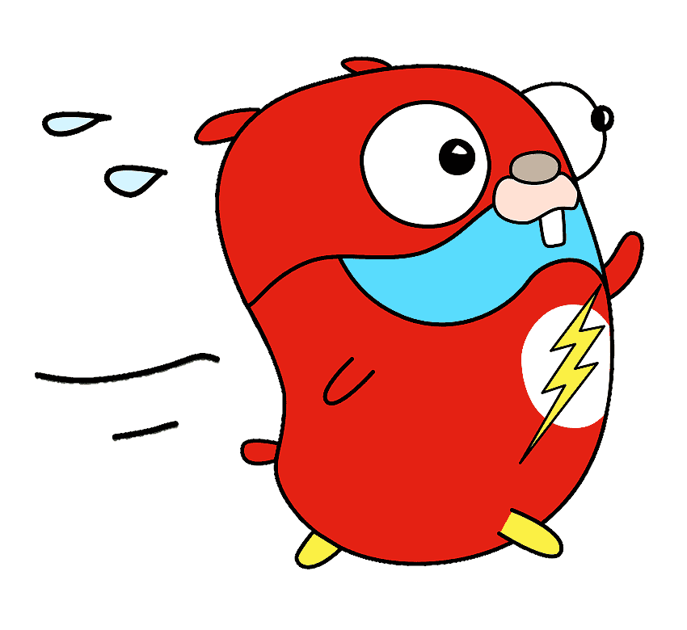

# go_api

Very simples API built in GO! to fetch data from a DataWarehouse.
  

    

Credentials for db access are obtained from envs and can be exported like this:

    export APP_HOST=127.0.0.1
    export APP_PORT=5432
    export APP_DB_USERNAME=pg_username
    export APP_DB_PASSWORD=pg_password
    export APP_DB_NAME=pg_db